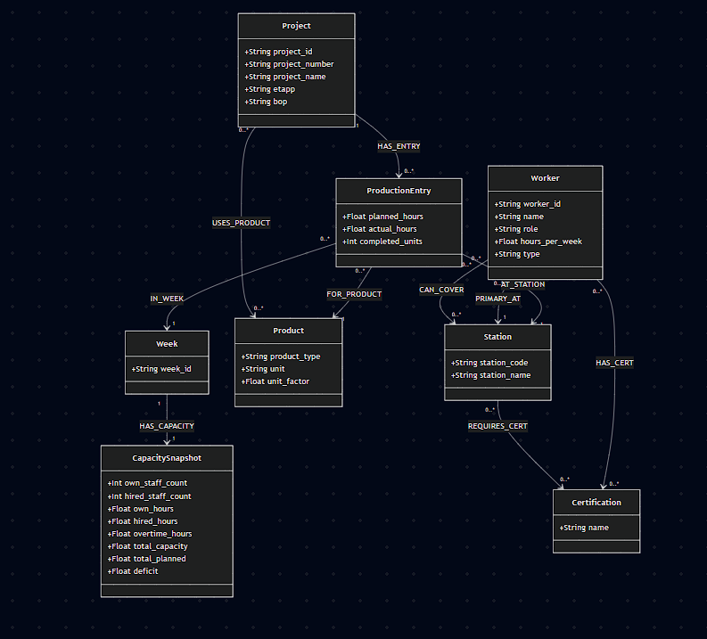
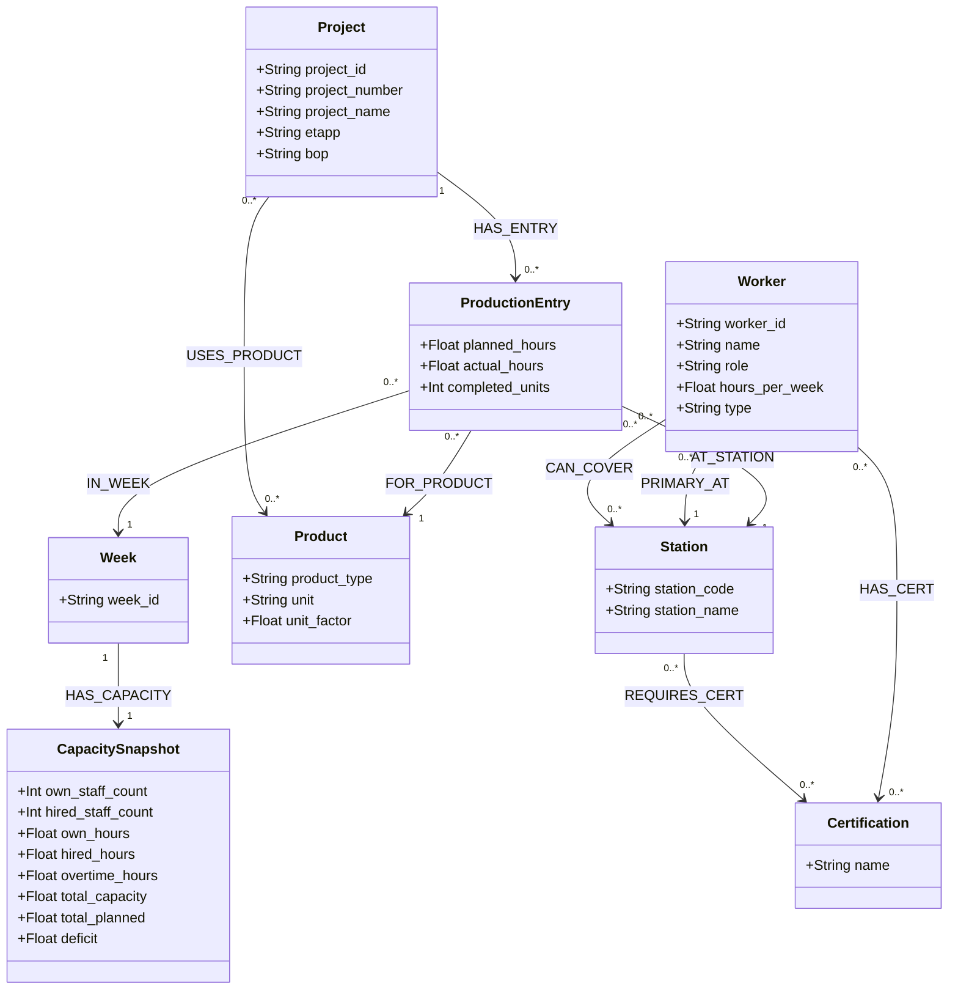

# Level 5 — Graph Schema

## Schema Diagram

## UML Class Diagram (Mermaid source)

> Rendered above — source below for reference

---

## Relationship Properties

Two relationships carry data — shown here because Mermaid class diagrams don't support inline relationship attributes:

| Relationship | Properties |
|---|---|
| `(ProductionEntry)-[:IN_WEEK]->(Week)` | `planned_hours`, `actual_hours`, `completed_units` |
| `(Project)-[:USES_PRODUCT]->(Product)` | `quantity`, `unit_factor` |

---

## Node Summary (8 labels)

| # | Label | Key Properties | CSV Source |
|---|-------|---------------|-----------|
| 1 | `Project` | project_id, project_number, project_name, etapp, bop | factory_production.csv |
| 2 | `ProductionEntry` | planned_hours, actual_hours, completed_units | factory_production.csv (one node per row) |
| 3 | `Station` | station_code, station_name | factory_production.csv |
| 4 | `Product` | product_type, unit, unit_factor | factory_production.csv |
| 5 | `Week` | week_id | both CSVs |
| 6 | `CapacitySnapshot` | own_staff_count, hired_staff_count, own_hours, hired_hours, overtime_hours, total_capacity, total_planned, deficit | factory_capacity.csv |
| 7 | `Worker` | worker_id, name, role, hours_per_week, type | factory_workers.csv |
| 8 | `Certification` | name | factory_workers.csv (split by comma) |

## Relationship Summary (10 types)

| # | Relationship | Direction | Properties |
|---|-------------|-----------|-----------|
| 1 | `HAS_ENTRY` | Project → ProductionEntry | — |
| 2 | `AT_STATION` | ProductionEntry → Station | — |
| 3 | `FOR_PRODUCT` | ProductionEntry → Product | — |
| 4 | `IN_WEEK` | ProductionEntry → Week | `planned_hours`, `actual_hours`, `completed_units` |
| 5 | `HAS_CAPACITY` | Week → CapacitySnapshot | — |
| 6 | `PRIMARY_AT` | Worker → Station | — |
| 7 | `CAN_COVER` | Worker → Station | — |
| 8 | `HAS_CERT` | Worker → Certification | — |
| 9 | `REQUIRES_CERT` | Station → Certification | — |
| 10 | `USES_PRODUCT` | Project → Product | `quantity`, `unit_factor` |
